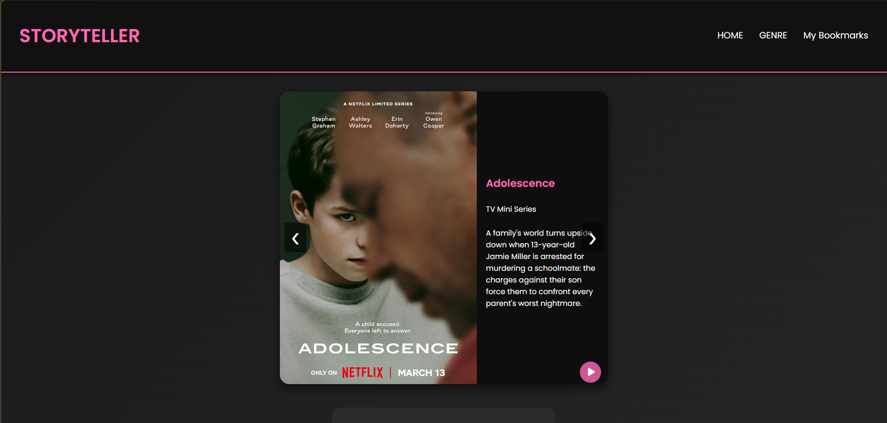
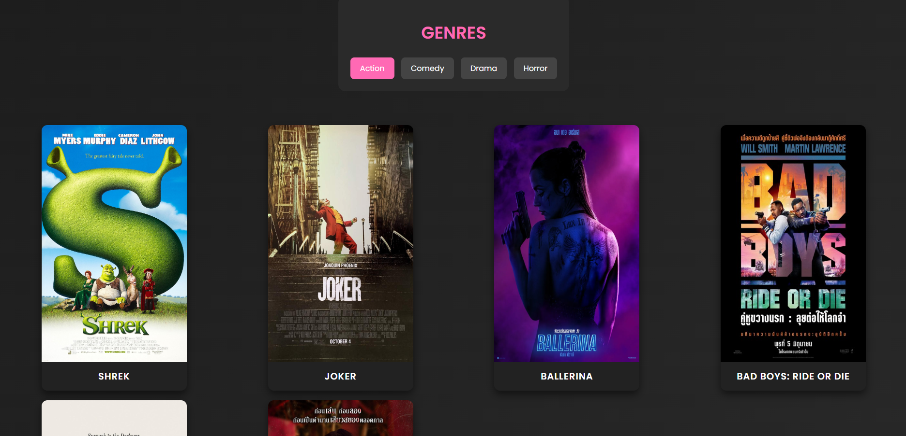
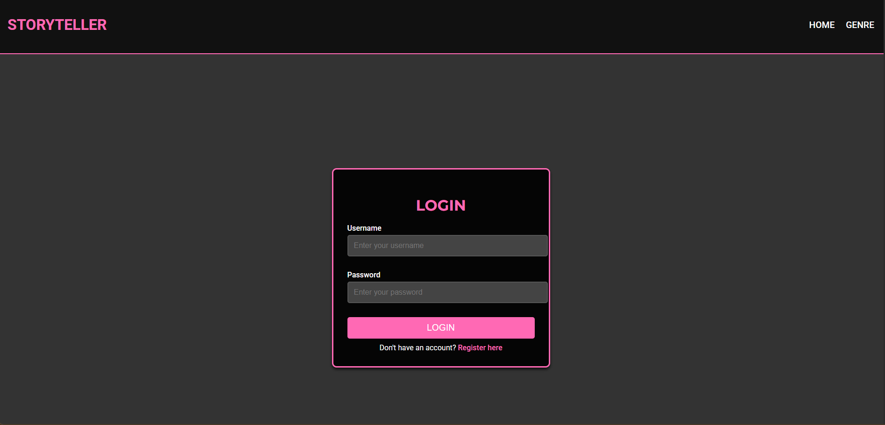
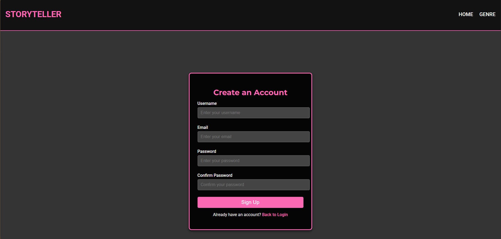
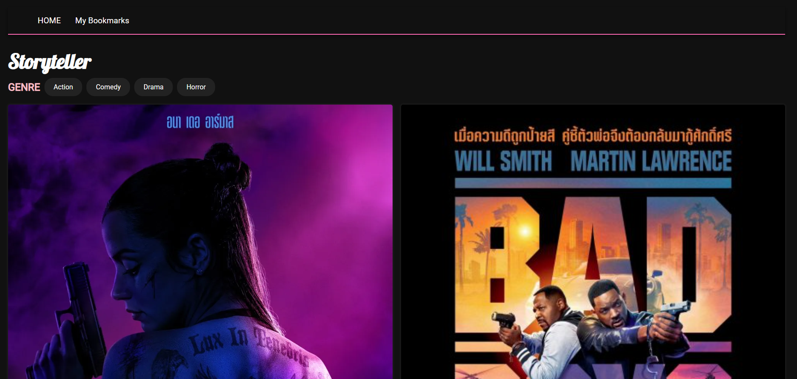
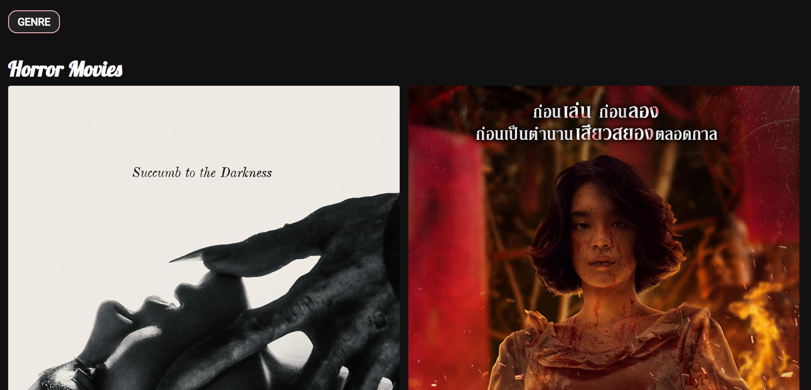
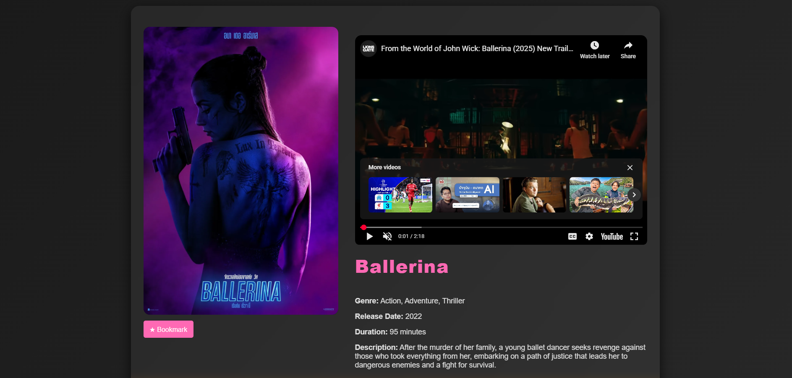
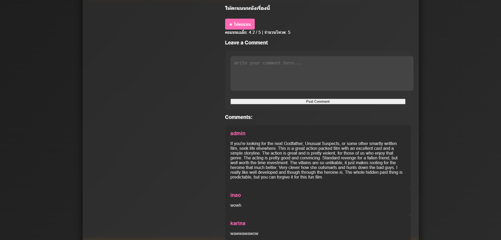
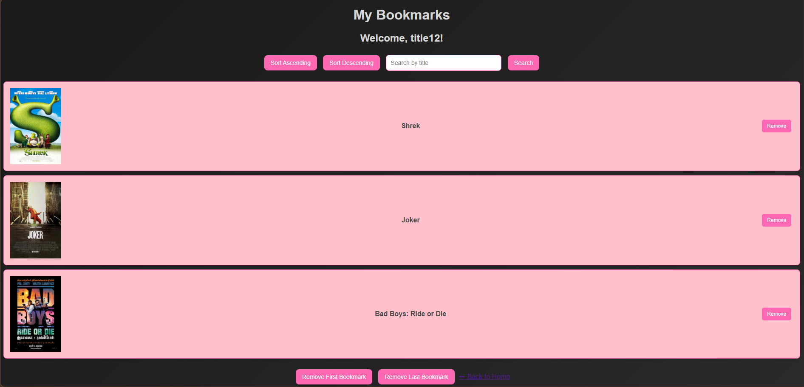

# 🎬 Storyteller Review System

A comprehensive Web Application for movie/story reviews and task management. Built with **Node.js** following the **MVC (Model-View-Controller)** architecture, leveraging a lightweight **JSON file-based system** for data persistence without requiring an external database server.

## 🚀 Project Overview

This project demonstrates a robust implementation of backend logic using Node.js. It integrates two main modules: a **Story Review System** (for bookmarking and rating content) and an internal **Task Management System**. The application focuses on clean architectural patterns, data manipulation, and security best practices.

## ✨ Key Features

### 🔐 1. Authentication & Security
* **Admin Login:** Secure access control using **Session-based Authentication**.
* **Data Security:** Implements custom data encryption mechanisms (utilizing the `util` class) to handle sensitive information.

### 📚 2. Bookmark Management
Complete control over user bookmarks with advanced manipulation features:
* **CRUD Operations:** Easily add and remove bookmarks.
* **Sorting:** Sort bookmarks alphabetically (A-Z) and reverse alphabetically (Z-A).
* **Search:** Filter bookmarks by title.
* **Advanced Deletion:** * `deleteFirstByUser`: Remove the oldest bookmark added by a specific user.
    * `deleteLastByUser`: Remove the most recent bookmark added by a specific user.

### ⭐ 3. Review & Rating System
* **Interactive Ratings:** Users can rate stories, with the system automatically calculating the **Average Rating** and tracking the total **Vote Count**.
* **Comments:** Users can submit feedback and comments on individual stories.

### 📝 4. Task Management
A built-in module for managing project tasks:
* **Task Handling:** Add and remove tasks dynamically.
* **Priority Sorting:** Organize tasks based on their priority levels.
* **Search:** Quickly find tasks by name.

## 🛠️ Tech Stack & Architecture

* **Runtime Environment:** Node.js
* **Framework:** Express.js (MVC Implementation)
* **Architecture:** Model-View-Controller (MVC)
* **Database:** JSON File-based System (`bookmarks.json`, `ratings.json`, `tasks.json`) - *No SQL/NoSQL installation required.*
* **Testing:** Unit Testing (via `test` directory)
* **CI/CD:** Azure Pipelines

## 📸 Screenshots

<p align="center">
  
  
  
  
  
  
  
  
  
</p>

## 📦 Installation & Setup

Follow these steps to run the project locally:

1.  **Clone the Repository**
    ```bash
    git clone https://github.com/WuttikornFunk/storyteller-review.git
    cd storyteller-review
    ```

2.  **Install Dependencies**
    ```bash
    npm install
    ```

3.  **Run the Application**
    ```bash
    npm start
    ```

4.  Access the App Open your browser and navigate to: http://localhost:3000

